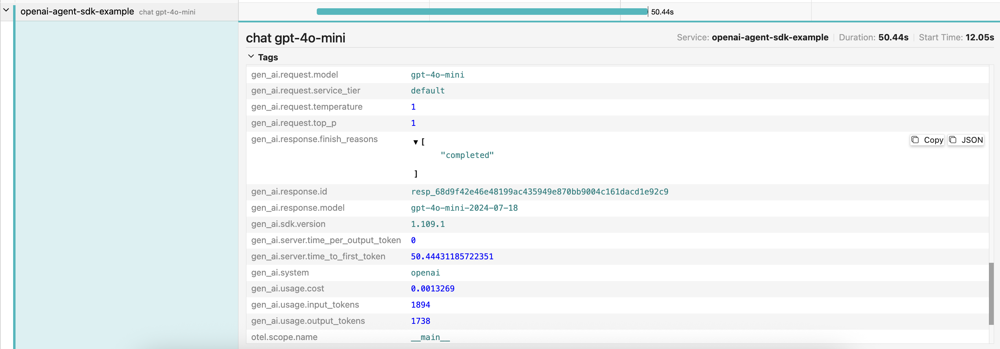
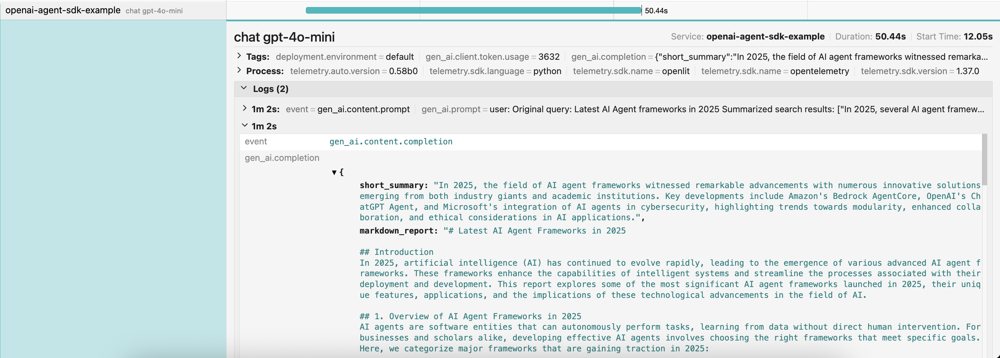

# OpenAI Agents SDK Deep Research Example with OpenTelemetry

OpenTelemetry is a popular, open-source project that can be used to capture telemetry 
from applications written in various languages. The telemetry can then be sent to an 
observability backend of your choice. 

This example demonstrates how [OpenTelemetry](https://opentelemetry.io/) 
can be used to capture traces from the OpenAI Agents SDK Deep Research 
example introduced in Week 2, Lab 4 of the course. 

For our example, we'll send traces to [Jaeger](https://www.jaegertracing.io/), which is an 
open-source platform for distributed tracing.  The OpenTelemetry collector configuration 
can be easily modified to send the traces to a different observability backend, if desired. 

## Prerequisites

* An OpenAI API key
* Python 3.12+
* Docker (required to run the OpenTelemetry Collector and Jaeger)
* [uv Package Manager](https://docs.astral.sh/uv/guides/install-python/#installing-a-specific-version)

## Clone the Repo

``` bash
# clone the repo if you haven't already
git clone https://github.com/ed-donner/agents.git

# navigate to the directory repo
cd agents/2_openai/community_contributions/deep_research_with_opentelemetry
```

## Run the OpenTelemetry Collector with Jaeger 

We'll use Docker Compose to run the OpenTelemetry Collector with Jaeger: 

``` bash
docker compose up
```

> Note: Jaeger v2 supports OpenTelemetry natively, so we technically don't require the 
> OpenTelemetry collector as well.  But I've included it in the example in case you'd 
> like to route the traces to another OpenTelemetry-compatible backend. 

Use your browser to navigate to [http://localhost:16686/](http://localhost:16686/) to access the Jaeger UI. 

## Install OpenTelemetry Packages 

Next, let's install OpenTelemetry's [Python zero-code instrumentation](https://opentelemetry.io/docs/zero-code/python/) 
which instruments our Python application with OpenTelemetry to capture traces: 

``` bash
uv add opentelemetry-distro opentelemetry-exporter-otlp
```

We'll also install [OpenLIT](https://openlit.io/) to enhance trace data with additional context 
related to LLM's: 

``` bash
uv add openlit
```

We need to upgrade the version of `openai-agents` as well (to ensure compatibility with OpenLIT): 

``` bash
uv add openai-agents==0.2.6
```

Next, run the following command to add additional instrumentation packages:

``` bash
uv run opentelemetry-bootstrap -a requirements | uv pip install --requirement -
```

## Set Environment Variables

The OpenTelemetry SDK uses environment variables to specify where to send the instrumentation data: 

``` bash
export OTEL_SERVICE_NAME=openai-agent-sdk-example
export OTEL_EXPORTER_OTLP_ENDPOINT=http://localhost:4317
export OTEL_EXPORTER_OTLP_PROTOCOL=grpc
```

Let's also set an environment variable with our email address, to avoid spamming Ed Donner :) 

> Note:  add your email address before running the commands below

``` bash
export FROM_EMAIL_ADDRESS=
export TO_EMAIL_ADDRESS=
```

## Update the Application Code 

We made a few changes related to OpenTelemetry in the [deep_research.py](./deep_research.py) file. 

First, we imported the following package: 

``` py
from opentelemetry import trace
from opentelemetry import metrics
from opentelemetry._logs import get_logger_provider
import openlit
```

Then we got the global tracer provider, meter provider, and logging provider, and initialized OpenLIT: 

``` py
tracer = trace.get_tracer(__name__)
meter_provider = metrics.get_meter_provider()
meter = meter_provider.get_meter(__name__, version="1.0.0")
logger_provider = get_logger_provider()
openlit.init()
```

And in the `run()` function, we start a new trace: 

``` py
    async def run(self):
        """ Run the deep research process """
        query = "Latest AI Agent frameworks in 2025"
        with tracer.start_as_current_span("deep-research") as current_span:
            print("Starting research...")
            search_plan = await self.plan_searches(query)
            search_results = await self.perform_searches(search_plan)
            report = await self.write_report(query, search_results)
            await self.send_email(report)  
            print("Hooray!")
```

## Run the Application

Execute the following command to run the application:

``` bash
uv run opentelemetry-instrument python deep_research.py
```

In Jaeger, we see that our trace had a total duration of 1 minute and 57 seconds: 


Clicking on one of the gpt-4o-mini spans, we can see the number of input and output tokens used for this request, the cost, and other 
attributes: 



We can even see the entire prompt and completion text associated with this 
request, which is helpful for troubleshooting: 



Capturing the prompt and completion text capture can be disabled if needed. 